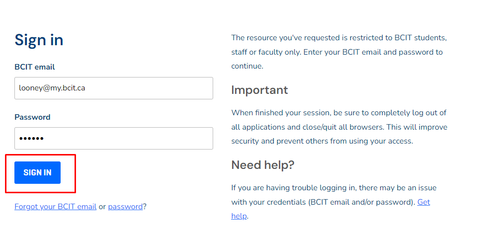
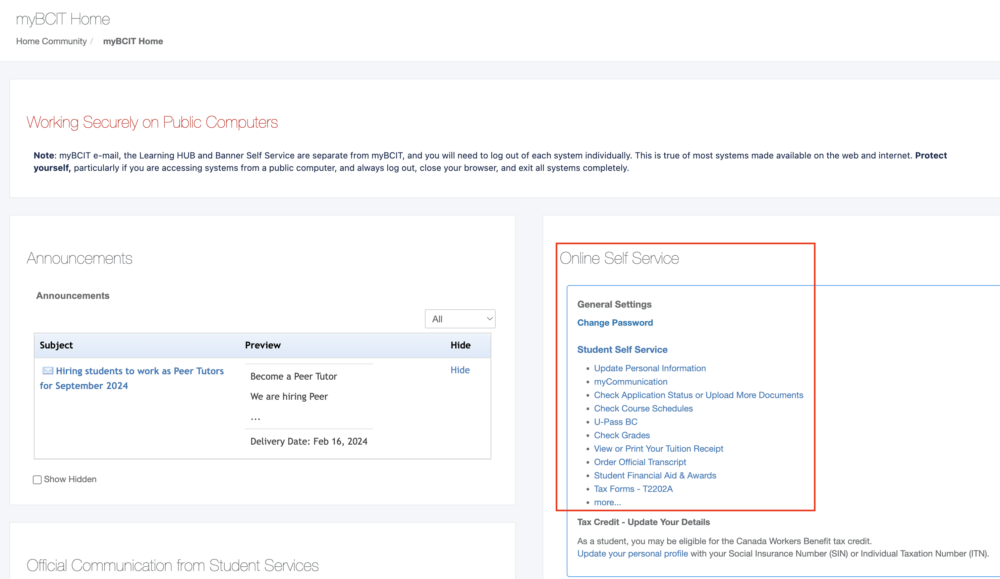
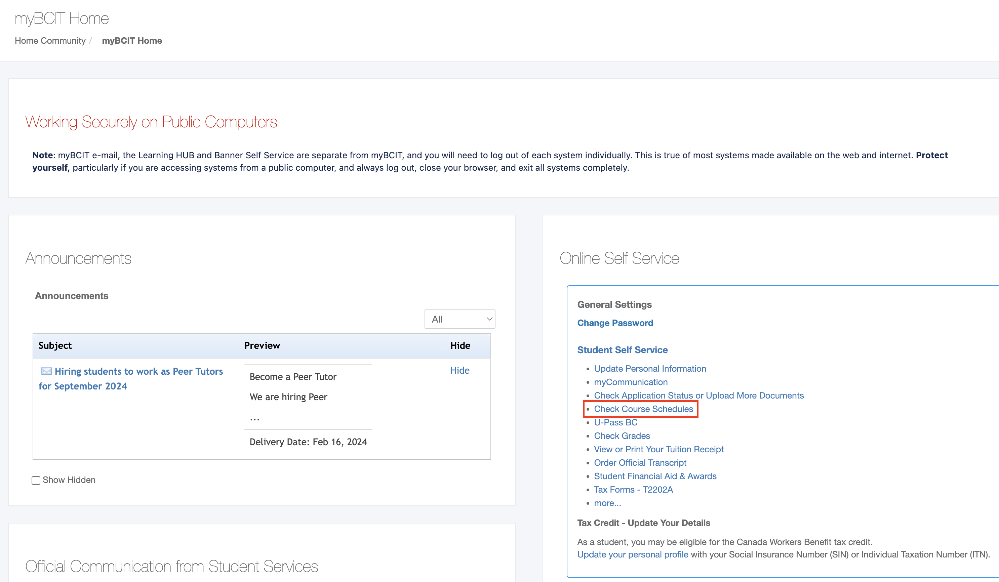
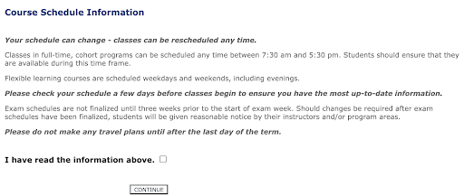
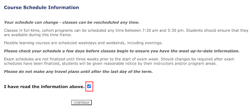
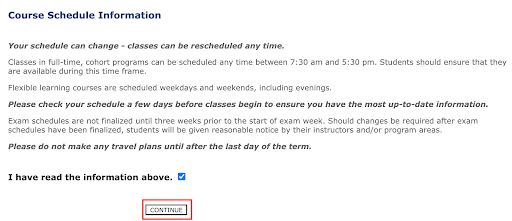
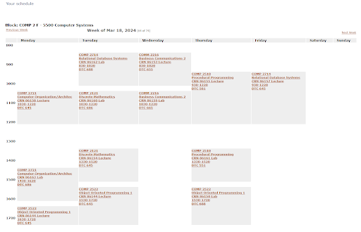

# Accessing BCIT Course Schedule

## Overview 

In this section, we will focus on helping you access your course schedule using MyBCIT website. This website will serve 
as your main way of accessing your school related information. By the end of this section you will know how to 
access your BCIT course schedule using the myBCIT Website.

## Steps to Login to myBCIT Website
Before accessing your BCIT course schedule, you will need to login to the myBCIT website.

1. Ensure you have a BCIT Account
 
    Example:
       - E-mail: <Looney@my.bcit.ca>
       - Password: 1234562

2. <u>**Type in the search bar** <https://my.bcit.ca></u> and **press the Enter key**. You will be directed to myBCIT Login 
   Page
     <figure markdown = "span"> { loading=lazy } </figure>

    !!! Note 
        BCIT recommends using Google Chrome, Microsoft Edge, or Mozilla Firefox as the web browser

3. <u>Type in your BCIT account credentials</u>
    <figure markdown = "span"> { loading=lazy } </figure>

4. **Click the "SIGN IN" button**
    <figure markdown = "span"> { loading=lazy } </figure>

    !!! Note
        You will now be directed to the myBCIT home page with your student name shown in the upper right of the 
        screen

## Navigate to Course Schedule
1. Find the “Online Self Service” category on the right side of the myBCIT website
    <figure markdown = "span">{ loading=lazy} 
   </figure>

2. In the “Student Self Service” header, **click on “Check Course Schedules”**
    <figure markdown = "span">{ loading=lazy} 
   </figure>

3. Read “Course Schedule Information”
    <figure markdown = "span">{ loading=lazy} 
   </figure>

4. **Click on the “I have read the information above” checkbox to show a checkmark**
    <figure markdown = "span">{ loading=lazy} 
   </figure>
5. **Click on the "Continue" Button**
    <figure markdown = "span">{ loading=lazy} 
   </figure>

!!! success
    Great job! You have access to your course schedule. You will find your course name and number, room number, and 
    course times
    <figure markdown = "span">{ loading=lazy} 
    </figure>

## Conclusion

By the end of this section, you will have learned the following:
<ul>
    <li id="staremoji"> ⭐&nbsp How to navigate through the myBCIT webpage </li>
    <li id="staremoji"> ⭐&nbsp How to access and view your course schedule </li>
</ul>

## Next Steps
Excellent work! Feel free to proceed to the next step.
 
 
[**Changing BCIT E-mail Signature**](task2.md)