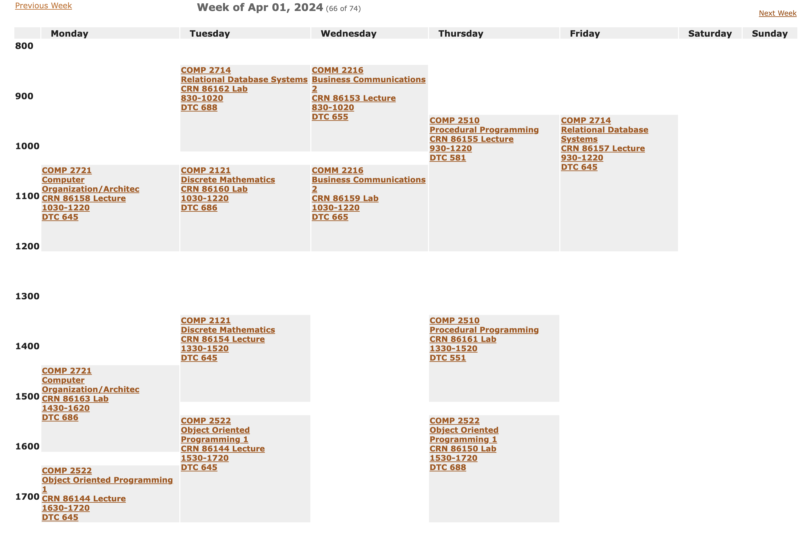

## Overview 

In this section, we will focus on helping you access your course schedule using MyBCIT website. This website will serve 
as your main way of accessing your school related information. By the end of this section you will know how to access your course
schedule in BCIT using BCIT Website

## Accessing your BCIT Schedule

1. Ensure you have a BCIT Account
 
    Example:
       - Email: <Looney@my.bcit.ca>
       - Password: 1234562

2. <u>**Type in the search bar** <https://my.bcit.ca></u> and **press the Enter key**. You will be directed to myBCIT Login 
   Page
     <figure markdown = "span"> { loading=lazy } </figure>

    !!! Note 
        BCIT recommends using Google Chrome, Microsoft Edge, or Mozilla Firefox as the web browser

3. <u>Type in your BCIT account credentials</u>
    <figure markdown = "span"> { loading=lazy } </figure>

4. **Click the "SIGN IN" button**
    <figure markdown = "span"> { loading=lazy } </figure>

    !!! Note
        You will now be directed to the myBCIT home page with your student name shown in the upper right of the 
        screen

5. Find the “Online Self Service” category on the right side of the myBCIT website
    <figure markdown = "span">{ loading=lazy} 
   </figure>

6. In the “Student Self Service” header, **click on “Check Course Schedules”**
    <figure markdown = "span">{ loading=lazy} 
   </figure>

7. Read “Course Schedule Information”
    <figure markdown = "span">{ loading=lazy} 
   </figure>

8. **Click on the “I have read the information above” checkbox to show a checkmark**
    <figure markdown = "span">{ loading=lazy} 
   </figure>
9. **Click on the "Continue" Button**
    <figure markdown = "span">{ loading=lazy} 
   </figure>

!!! success
    Great job! You have access to your course schedule. You will find your course name and number, room number, and 
    course times
    <figure markdown = "span">{ loading=lazy} 
    </figure>
