## Overview

In this section, we will walk you through how to Change your BCIT email signature which will always be attached at the bottom of every email you sent.
By the end of this section emails you have sent using the BCIT email will have the corresponding signature you use in this section.

## Changing your Email Signature

1. Ensure you have a BCIT Account  
    Example:
       - Email: <Looney@my.bcit.ca>
       - Password: 1234562

2. Open the Web Browser you want to use

<figure markdown = "span">{: style="height:250px;width:250px"} </figure>

!!! Note
    BCIT recommends using Chrome,Firefox, or Edge as your main web browser

3. **Type in the Search bar** <https://my.bcit.ca> and **click Enter**, you will be directed to BCIT Login Page

<figure markdown = "span"> { loading=lazy } </figure>

4. Type in your Account Credentials
    <!-- Email: <rmaceda1@mybcit.ca>
    Password: 123456789 
    // Maybe we can remove this -->

<figure markdown = "span"> 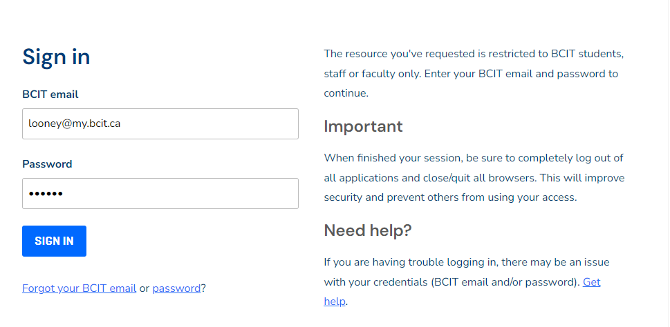{ loading=lazy } </figure>

5. **Click the "SIGN IN" button**

<figure markdown = "span"> { loading=lazy } </figure>

!!! Note
    You will now be directed to the MyBCIT Home Tab with your student name shown in the upper right of the screen

<figure markdown = "span"> 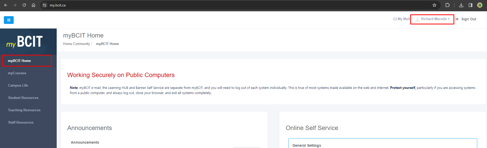{ loading=lazy } </figure>

!!! Danger
    Repeatedly signing in with wrong credentials can cause the BCIT Website to block you devices from logging in

6. **Click "My Mail”** which is seen on the left of your student name

<figure markdown = "span"> 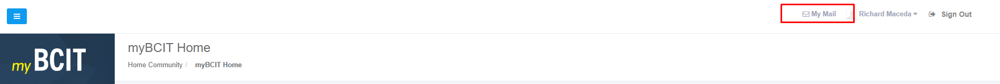{ loading=lazy } </figure>

!!! Note
    You will be directed to your BCIT Mail Webpage to your mail inbox

<figure markdown = "span"> 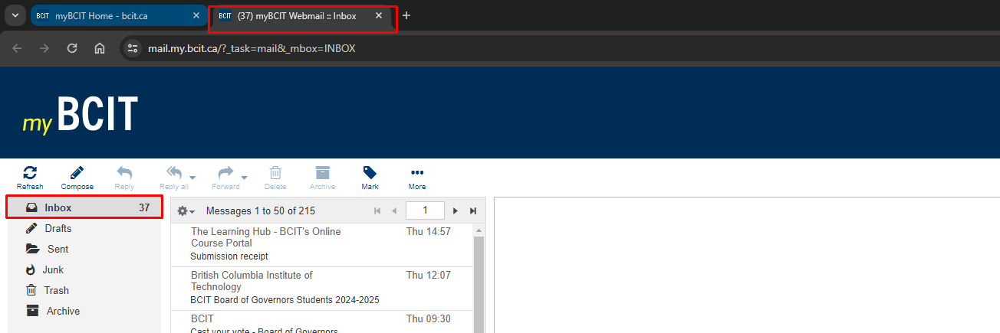{ loading=lazy } </figure>

7. **Click “Settings”,** found on the upper right of the website

<figure markdown = "span"> 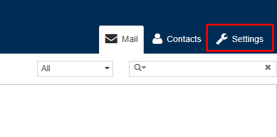{ loading=lazy } </figure>

!!! Note
    You will now be directed to the “Settings” page

<figure markdown = "span"> 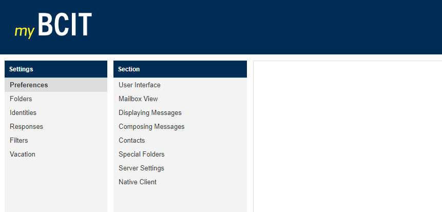{ loading=lazy } </figure>

8. **Click “Identities”** under the Settings header

<figure markdown = "span"> 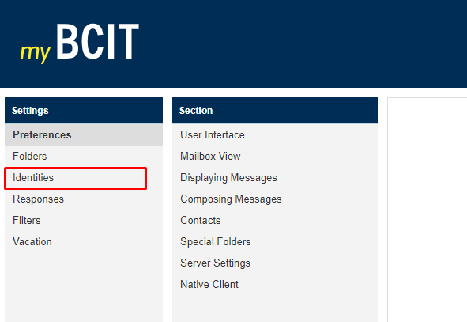{ loading=lazy } </figure>

9. **Click your Name** found under the Identities header

<figure markdown = "span"> 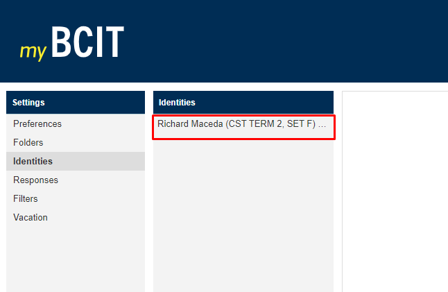{ loading=lazy } </figure>

!!! Note
    It will open the Edit Identity on the Right Side

<figure markdown = "span"> 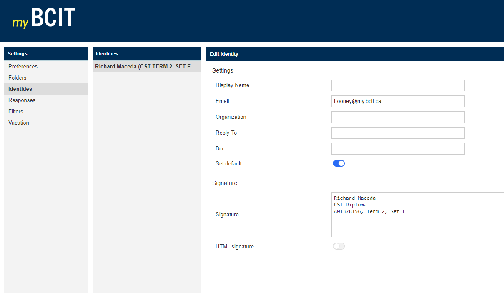{ loading=lazy } </figure>

10. **Click on the Textbox** beside the Signature to start editing it

<figure markdown = "span"> 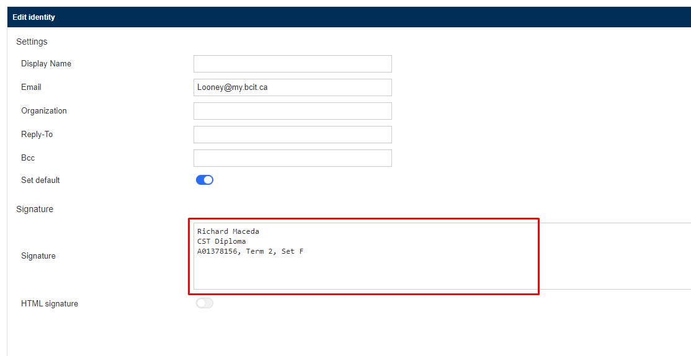{ loading=lazy } </figure>

11. **Click the blue button “Save”**, after you finish editing to save it.

<figure markdown = "span"> 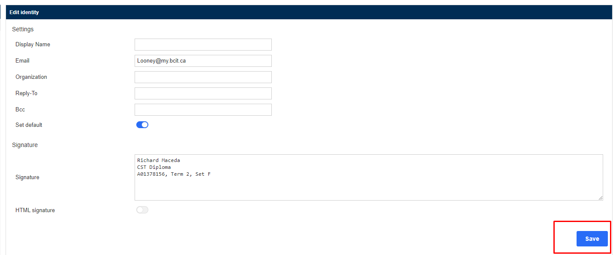{ loading=lazy } </figure>

<!-- !!! Note
    Do not leave the page if you want to follow the test below if you done it right. WE MIGHT want to remove this-->

## Verifying Signature

Test to ensure the signature is seen when you send a email

12. **Click “Mail”** found on the upper right of the website, to go back to your BCIT Mail Inbox

<figure markdown = "span"> 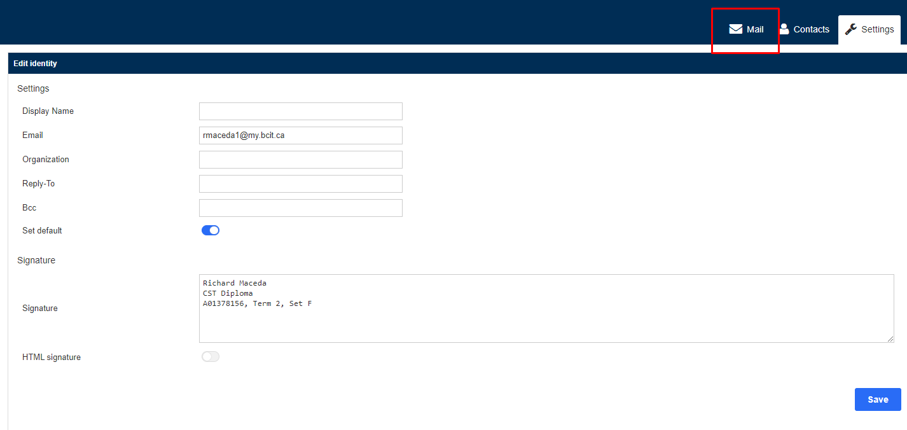{ loading=lazy } </figure>

13. **Click “Compose”** found on the upper left of the website

<figure markdown = "span"> 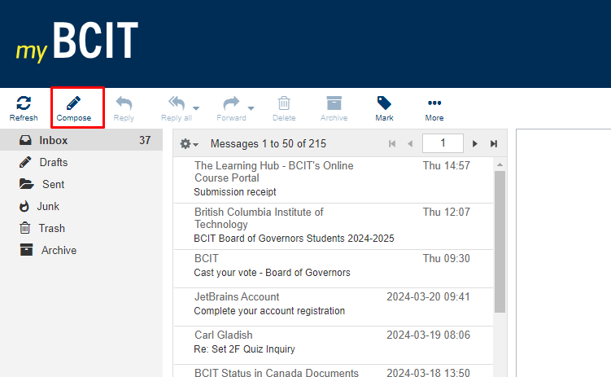{ loading=lazy } </figure>

!!! Note
    You will now be directed to a page where you will be composing an email.

14. Verify the signature block on the if it corresponds to your edited signature.

<figure markdown = "span"> 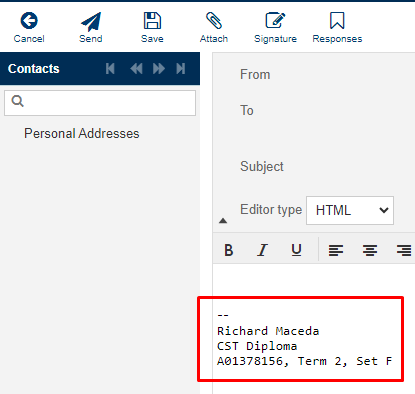{ loading=lazy: style="height:400px;width:300px" }  </figure>
