# Forwarding BCIT Email

## Overview

In this section, we will walk you in setting up your BCIT email forwarding to other email you may own. By the end of this
section the email you have used during the walkthrough will receive email from your BCIT email inbox.

1. Ensure you have a BCIT Account  
    Example:
    - Email: <Looney@my.bcit.ca>
    - Password: 1234562

2. <u>**Type in the Search bar <https://my.bcit.ca>**</u> and *click Enter*, you will be directed to BCIT Login Page

    <figure markdown = "span"> { loading=lazy } </figure>

3. <u>**Type in your Account Credentials**</u>
    <!-- Email: <rmaceda1@mybcit.ca>
    Password: 123456789 
    // Maybe we can remove this -->

    <figure markdown = "span"> { loading=lazy } </figure>

4. **Click the "SIGN IN" button**

    <figure markdown = "span"> { loading=lazy } </figure>

    !!! Note
        You will now be directed to the MyBCIT Home Tab with your student name shown in the upper right of the screen

    <figure markdown = "span"> 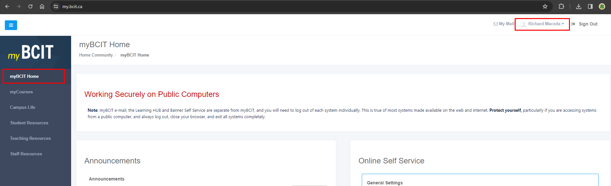{ loading=lazy } </figure>

    !!! Danger
        Repeatedly signing in with wrong credentials can cause the BCIT Website to block your devices from logging in

5. **Click on “My Mail”** at the top-right corner

    <figure markdown = "span"> { loading=lazy } </figure>

    !!! Note
        You will be directed to your BCIT Mail Inbox Page in a new tab

6. **Click** “Settings”, found on the upper right of the website

    <figure markdown = "span"> { loading=lazy } </figure>

7. **Click** on “Filter”, found on the left side of the page

    <figure markdown = "span"> 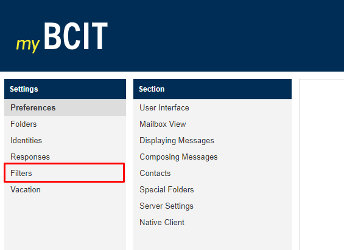{ loading=lazy } </figure>

8. **Click on +** found under the filters set section

    <figure markdown = "span"> 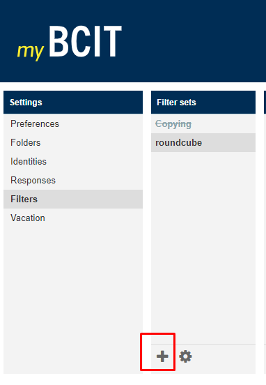{ loading=lazy } </figure>

    !!! Note
        This will open the new filters set in the right side

    <figure markdown = "span"> 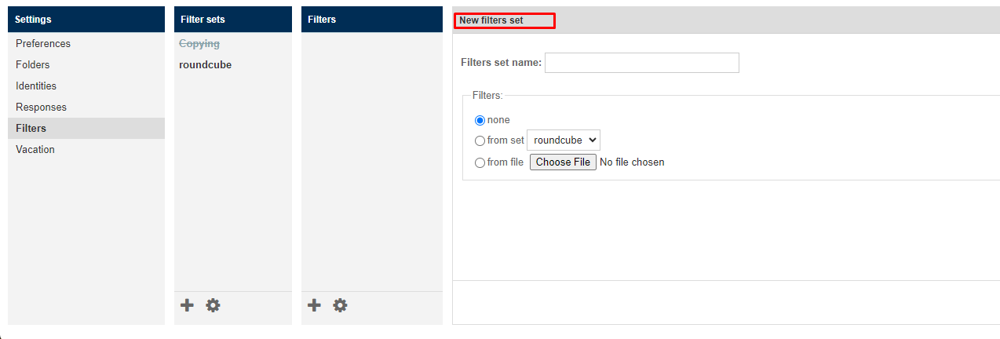{ loading=lazy } </figure>

9. <u>**Type "Forwarding" for Filters Set Name**</u> and **select and click none for filters**

    <figure markdown = "span"> 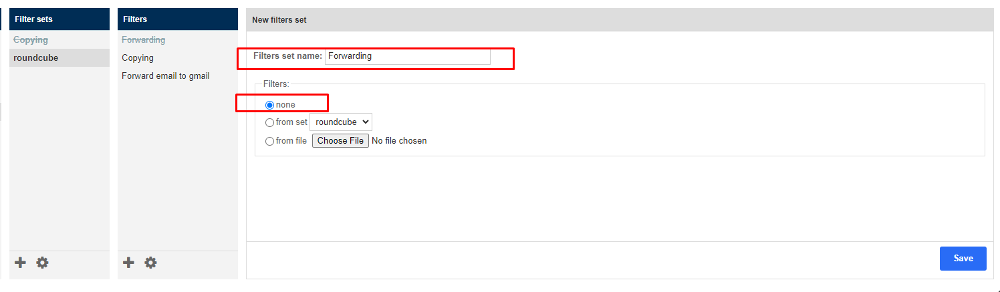{ loading=lazy } </figure>

    !!! Note
    - This will create a filter set named Forwarding under filter sets
    - which allows you to group the different filters you want for your emails

10. Find and **click the newly created filter set name "Forwarding"** under the "Filter Sets"

    <figure markdown = "span"> 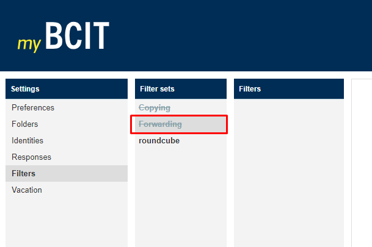{ loading=lazy } </figure>

11. **Click on the +** under "filters"

    <figure markdown = "span"> 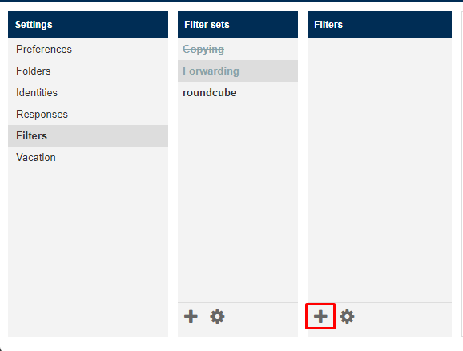{ loading=lazy } </figure>

    !!! Note
        This will open "Filter Definition" section

12. <u>**Type "Forwarding to Gmail"**</u> for Filter name and Select "all messages"

    <figure markdown = "span"> 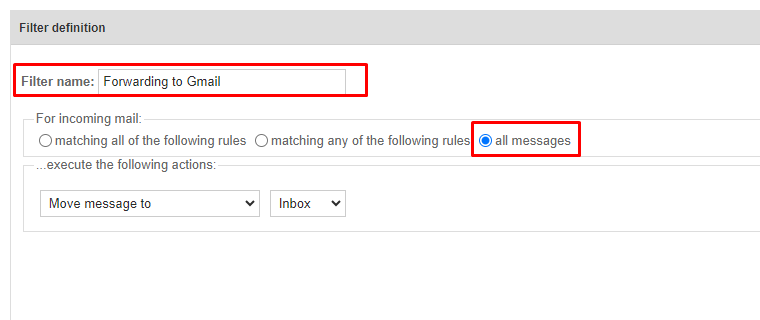{ loading=lazy } </figure>

13. **Click** on the drop-down menu and select “Redirect message to”

    <figure markdown = "span"> 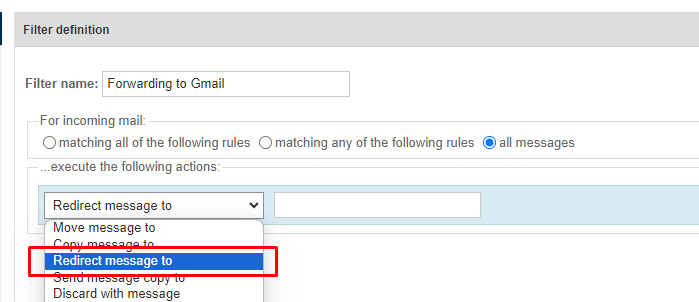{ loading=lazy } </figure>

14. <u>**Type the email address**</u> that you want to forward your incoming BCIT Emails to

    <figure markdown = "span"> 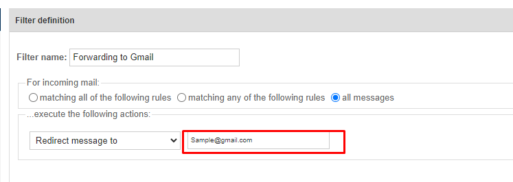{ loading=lazy } </figure>

15. **Click** on the “Save” button

    <figure markdown = "span"> 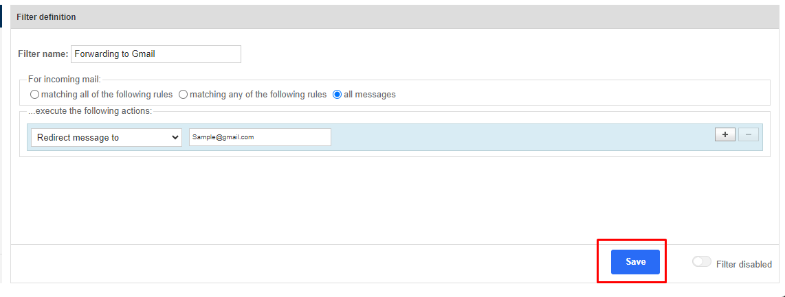{ loading=lazy } </figure>

    !!! Success
        - The newly created filter profile will appear under filters  
        - Now, all e-mails sent to your myBCIT e-mail address will automatically be forwarded to the e-mail address(es) you specified

## Conclusion

By the end of this section, you will have learned the following:
<ul>
    <li id="staremoji"> ⭐&nbsp How to forward emails receive in your BCIT inbox to a different email</li>
    <li id="staremoji"> ⭐&nbsp How to create filter sets and join different filters together</li>
</ul>

## Next Steps
You're an expert now! The next page has information to help troubleshoot any issues you may have encountered.
 
 
[**Troubleshooting**](troubleshooting.md)