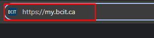

# Forwarding BCIT Email

## Overview

In this section, we will walk you through how to enable e-mail forwarding from your BCIT e-mail to a more frequently 
used e-mail. By enabling this feature, you'll enjoy quicker access to your BCIT 
e-mails and minimizes the risk of missing important e-mails. Additional benefits include[1](#fn1)
:

- Enhanced Productivity
- Centralized Mailbox

By the end of this section, you'll be comfortable setting up a forwarding system from your BCIT e-mail to your desired 
e-mail address(es).

## Steps to Login to myBCIT Website

Before forwarding your e-mail, you will need to login to the myBCIT website:

1. Ensure you have a BCIT Account  
    Example:
    - E-mail: <Looney@my.bcit.ca>
    - Password: 1234562

2. <u>Type in the search bar: [https://my.bcit.ca/](https://my.bcit.ca/)</a></u> 
   and **press the Enter key**. You will be directed to myBCIT Login 
   Page

    <figure markdown = "span"> { loading=lazy } </figure>

3. <u>**Type in your Account Credentials**</u>

    <figure markdown = "span"> { loading=lazy } </figure>

4. **Click the "SIGN IN" button**

    <figure markdown = "span"> { loading=lazy } </figure>

    !!! Note
        You will now be directed to the myBCIT Home Tab with your student name shown in the upper right of the screen

    <figure markdown = "span"> { loading=lazy } </figure>

    !!! Danger
        Repeatedly signing in with wrong credentials can cause the BCIT Website to block your devices from logging in

## Navigate to BCIT Mail

1. **Click on “My Mail”** at the top-right corner

    <figure markdown = "span"> { loading=lazy } </figure>

    !!! Note
        You will be directed to your BCIT Mail Inbox Page in a new tab

## Creating a Filter Set

1. **Click** “Settings”, found on the upper right of the website

    <figure markdown = "span"> { loading=lazy } </figure>

2. **Click** on “Filter”, found on the left side of the page

    <figure markdown = "span"> { loading=lazy } </figure>

3. **Click on +** found under the filters set section

    <figure markdown = "span"> { loading=lazy } </figure>

    !!! Note
        This will open the new filters set in the right side

    <figure markdown = "span"> { loading=lazy } </figure>

4. <u>**Type "Forwarding" for Filters Set Name**</u> and **select and click none for filters**

    <figure markdown = "span"> { loading=lazy } </figure>

    !!! Note
    - This will create a filter set named Forwarding under filter sets
    - which allows you to group the different filters you want for your e-mails

5. Find and **click the newly created filter set name "Forwarding"** under the "Filter Sets"

    <figure markdown = "span"> { loading=lazy } </figure>

## Enabling Email Forwarding

1. **Click on the +** under "filters"

    <figure markdown = "span"> { loading=lazy } </figure>

    !!! Note
        This will open "Filter Definition" section

2. <u>**Type "Forwarding to Gmail"**</u> for Filter name and Select "all messages"

    <figure markdown = "span"> { loading=lazy } </figure>

3. **Click** on the drop-down menu and select “Redirect message to”

    <figure markdown = "span"> { loading=lazy } </figure>

4. <u>**Type the e-mail address**</u> that you want to forward your incoming BCIT Emails to

    <figure markdown = "span"> { loading=lazy } </figure>

5. **Click** on the “Save” button

    <figure markdown = "span"> { loading=lazy } </figure>

    !!! Success
        - The newly created filter profile will appear under filters  
        - Now, all e-mails sent to your myBCIT e-mail address will automatically be forwarded to the e-mail address(es) you specified

## Conclusion

By the end of this section, you will have learned the following:
<ul>
    <li id="staremoji"> ⭐&nbsp How to forward e-mails from your BCIT inbox to a different e-mail address</li>
    <li id="staremoji"> ⭐&nbsp How to create filter sets and join different filters together</li>
</ul>

## Next Steps

You're an expert now! The next page has information to help troubleshoot any issues you may have encountered.
 
 
**[Troubleshooting](troubleshooting.md)** </a>

***
<a id="fn1"> [1. The benefits of using email forwarding](https://ca.indeed.
com/career-advice/career-development/how-to-forward-email#:~:text=Benefits%20of%20email%20forwarding) </a>
